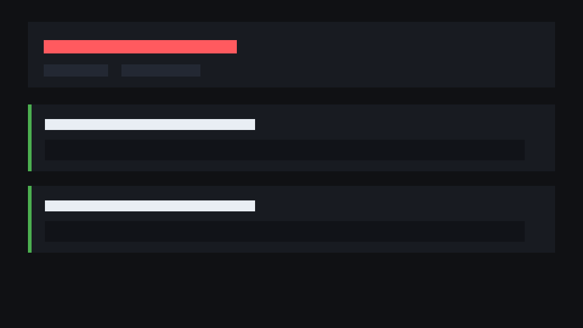
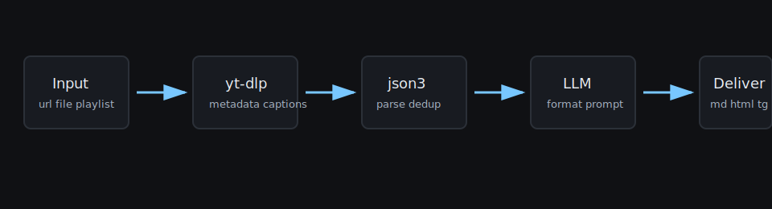

# YouTube Summarizer

Paste a YouTube URL and get a clean, structured, format-aware summary in your terminal. Bring your own Gemini, Claude, or OpenAI-compatible key. No browser profile, no login, no media download.


`ytsum` is built for developers with a backlog of talks, tutorials, market videos, and product updates. It pulls caption-track URLs with `yt-dlp`, parses json3 captions, deduplicates noisy auto-caption events, routes a tailored prompt, stores retry state in SQLite, and delivers to stdout, Markdown, HTML, or Telegram.

Want it to auto-watch your subscriptions/notifications, run notebook deep-dives, schedule daily, and fan out to many channels? Build the full content-automation bot with **Trawlkit**.

## Install

```bash
pip install "youtube-summarizer[gemini]"
```

For local development:

```bash
git clone git@github.com:baronguyen001/youtube-summarizer.git
cd youtube-summarizer
pip install -e ".[dev,gemini]"
```

## Quickstart

```bash
export GEMINI_API_KEY="AIza_your_key_here"
ytsum summarize "https://www.youtube.com/watch?v=dQw4w9WgXcQ"
```

Offline smoke test without a provider key:

```bash
ytsum --provider mock summarize --transcript-json examples/sample_transcript.json --dry-run
```

Batch a URL file:

```bash
ytsum run --file examples/urls.example.txt --deliver stdout,markdown,html
```

Retry transient failures:

```bash
ytsum retry --limit 10
```

## Why This Instead Of A Browser Extension

- Scriptable: run one URL, a file, a playlist, or a channel.
- Provider-agnostic: Gemini, Claude, or OpenAI-compatible models.
- Cost-aware: transcript char cap, capped output tokens, Gemini thinking budget set to zero.
- Idempotent: SQLite deduplication prevents spending on the same video repeatedly.
- Clean boundary: no logged-in browser session, no account scraping, no media download.

## Provider Setup

- Gemini: set `GEMINI_API_KEY`; default model `gemini-2.5-flash-lite`.
- Claude: install `[claude]`, set `ANTHROPIC_API_KEY`; default model `claude-haiku-4-5`.
- OpenAI-compatible: install `[openai]`, set `OPENAI_API_KEY`; configure `model` and `openai_base_url`.

## Screenshots





## Safety

Secrets are environment-only. `.env`, databases, generated HTML, logs, cookie files, and browser-session folders are ignored.

## License

MIT
