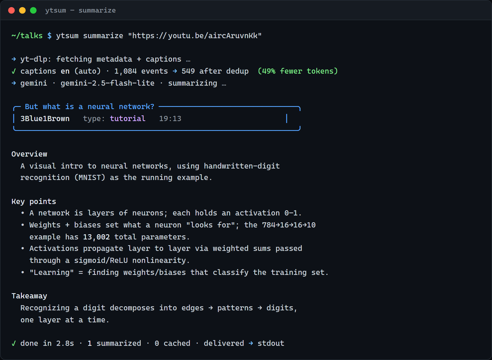

<div align="center">

# YouTube Summarizer (`ytsum`)

**Paste a YouTube URL → get a clean, structured, format-aware summary in your terminal.**
Bring your own Gemini, Claude, or OpenAI-compatible key. No browser profile, no login, no media download — just the transcript.

[](https://github.com/baronguyen001/youtube-summarizer/stargazers)
[](LICENSE)
[](https://github.com/baronguyen001/youtube-summarizer/actions)
[](https://github.com/baronguyen001/youtube-summarizer/commits/main)
[](https://www.python.org/)



</div>

`ytsum` is built for developers with a backlog of talks, tutorials, market videos, and product updates. It pulls caption-track URLs with `yt-dlp`, parses json3 captions, **deduplicates noisy auto-caption events (~50% fewer tokens)**, routes a format-aware prompt, stores retry state in SQLite, and delivers to stdout, Markdown, HTML, or Telegram.

> **Want more?** Auto-watch your subscriptions/notifications, run notebook deep-dives, schedule daily, and fan out to many channels — build the full content-automation bot with **[Trawlkit](https://github.com/baronguyen001)**.

## Install

```bash
# Direct from GitHub (PyPI release coming soon)
pip install "youtube-summarizer[gemini] @ git+https://github.com/baronguyen001/youtube-summarizer.git"
```

For local development:

```bash
git clone https://github.com/baronguyen001/youtube-summarizer.git
cd youtube-summarizer
pip install -e ".[dev,gemini]"
```

Swap `[gemini]` for `[claude]` or `[openai]` to install the provider you want.

## Quickstart (30 seconds)

```bash
export GEMINI_API_KEY="AIza_your_key_here"
ytsum summarize "https://www.youtube.com/watch?v=dQw4w9WgXcQ"
```

Offline smoke test (no provider key needed):

```bash
ytsum --provider mock summarize --transcript-json examples/sample_transcript.json --dry-run
```

Batch a file of URLs and fan out delivery:

```bash
ytsum run --file examples/urls.example.txt --deliver stdout,markdown,html
```

Re-summarize transient failures, and check stats:

```bash
ytsum retry --limit 10
ytsum stats
ytsum doctor      # checks provider key, yt-dlp, db writability
```

## Features

| Feature | What it does |
|---|---|
| **Provider-agnostic** | One adapter dispatches to Gemini, Claude (Anthropic), or any OpenAI-compatible endpoint. Your key, your model. |
| **json3 caption dedup** | Auto-captions emit overlapping intermediate + final events; keeping only finals cuts input tokens **~50%**. |
| **Format-aware prompts** | Auto-detects the video kind (tech / tutorial / finance / business / news / general) and applies a tailored template. |
| **Cost-aware** | Transcript char-cap, capped output tokens, Gemini `thinkingBudget=0`, exponential backoff on 429/5xx. |
| **Retry intelligence** | SQLite dedup never re-summarizes a done video; transient failures retry, permanent ones (no captions / private / members-only) never do. |
| **Multiple inputs** | A single URL, a file of URLs, a public playlist, or a public channel — all via `yt-dlp`, no login. |
| **Multiple outputs** | stdout, a Markdown digest, a styled HTML page, or one Telegram message per video. |

## Why this instead of a browser-extension summarizer?

I had a YouTube "watch later" backlog I would never actually watch, and every summarizer I tried was a browser extension or a web SaaS: it wanted a logged-in session, summarized one video at a time, used *its* model on *its* key, and gave me no way to script it.

`ytsum` is the opposite: it runs in your terminal or a cron job, batches a whole playlist/channel, uses **your** Gemini/Claude key with cost guards, never touches a logged-in browser, and stores state so a daily run never pays to summarize the same video twice.

## Use cases

- **Clear a talk/tutorial backlog** — point it at a playlist, get one Markdown digest.
- **Daily channel digest** — `ytsum run --channel <@handle> --limit 5` on a cron → Telegram.
- **Research a topic fast** — summarize 10 videos to stdout and skim the structured output.
- **Self-hosted, private** — your key, your machine, no third-party SaaS reading your queue.

## FAQ

**Is this just an AI wrapper?** The LLM call is one stage. The value is the pipeline around it: caption-track resolution without a browser, the json3 dedup that halves tokens, format detection, SQLite retry/permanent-fail classification, and multi-channel delivery — the parts that make summarizing *at scale* cheap and repeatable.

**Is it free?** The tool is MIT and free. You pay only your own LLM provider for tokens — and the cost guards (dedup, char-cap, `thinkingBudget=0`, cheap default models) are built to keep that small.

**Does it phone home or leak my keys?** No. Keys are read from environment variables only — there is **no hardcoded fallback key anywhere**, and keys are scrubbed from any logged URL/error. `.env`, databases, cookies, and browser-session folders are git-ignored. Nothing is sent anywhere except your chosen LLM provider and (if you enable it) your own Telegram chat.

**Do I need ffmpeg or a Google login?** Neither. `yt-dlp` fetches caption-track URLs without downloading media, and the happy path needs no cookies.

## Docs

- [Pipeline](docs/pipeline.md) — every stage + data contracts
- [Config](docs/config.md) — every config key
- [Providers](docs/providers.md) — Gemini vs Claude vs OpenAI setup + cost notes
- [Scheduling](docs/scheduling.md) — cron + Windows Task Scheduler examples
- [Auto-ingest](docs/auto-ingest.md) — auto-watch subscriptions + notebook deep-dives (→ Trawlkit)

## Related

Part of a small portfolio of scriptable dev/AI tools — each links up to the **[Trawlkit](https://github.com/baronguyen001)** content-automation kit:

- [`ai-news-aggregator`](https://github.com/baronguyen001/ai-news-aggregator) — RSS → AI filter → digest
- [`gemini-agent-toolkit`](https://github.com/baronguyen001/gemini-agent-toolkit) — agent patterns for Gemini
- [`gemini-cookbook`](https://github.com/baronguyen001/gemini-cookbook) — runnable Gemini recipes

## Contributing

Issues and PRs welcome — look for [`good first issue`](https://github.com/baronguyen001/youtube-summarizer/issues). Made a video or wrote a post about `ytsum`? Open a PR and I'll link it here.

## Contact

Questions, ideas, or want to work together? Reach me on X [@baronguyen001](https://x.com/baronguyen001) or email [baronguyen001@gmail.com](mailto:baronguyen001@gmail.com).

## License

MIT — see [LICENSE](LICENSE).

## Star history

[](https://www.star-history.com/#baronguyen001/youtube-summarizer&Date)
